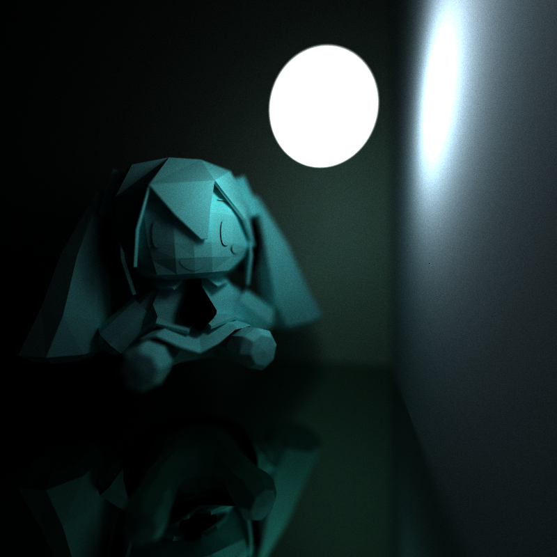
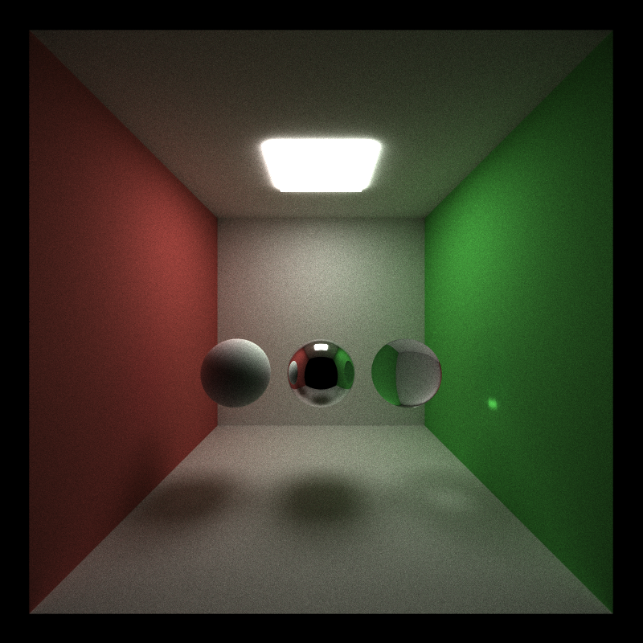
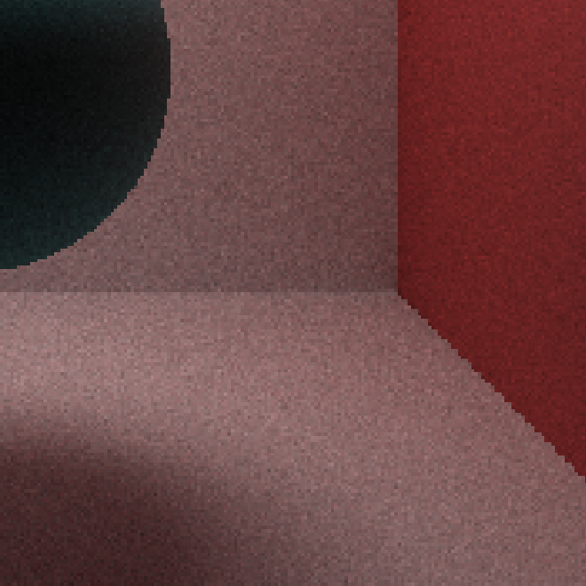
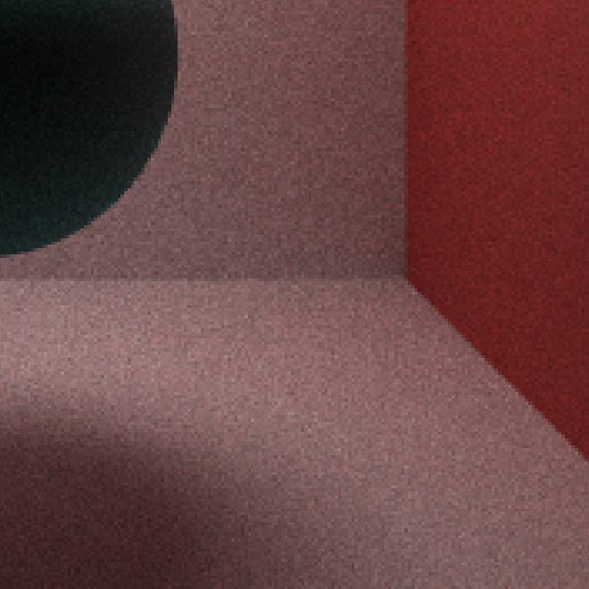
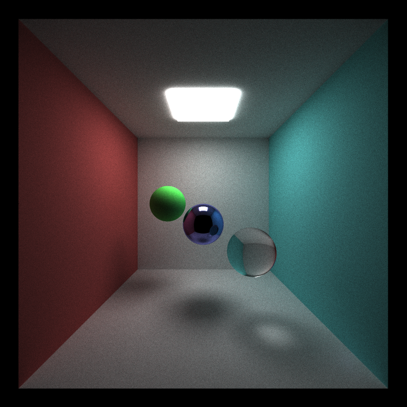
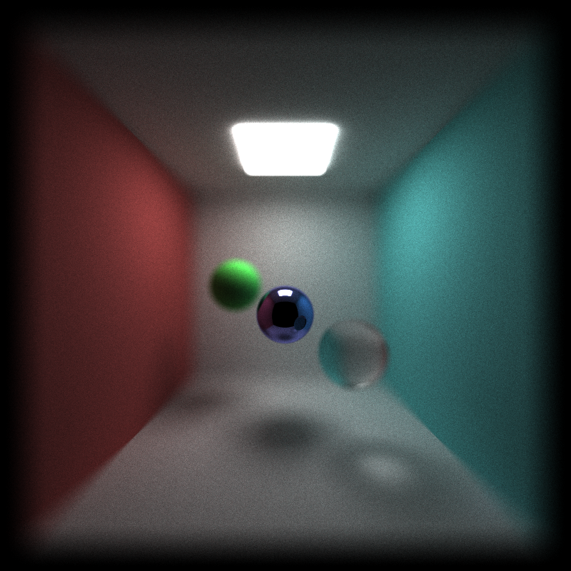
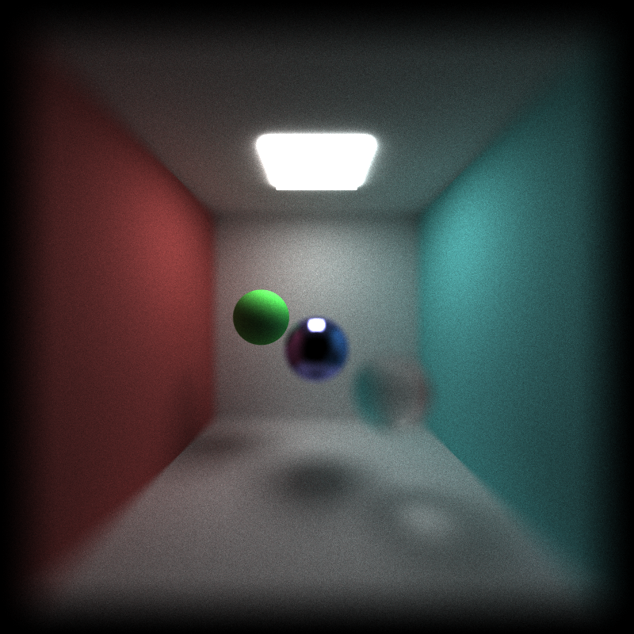
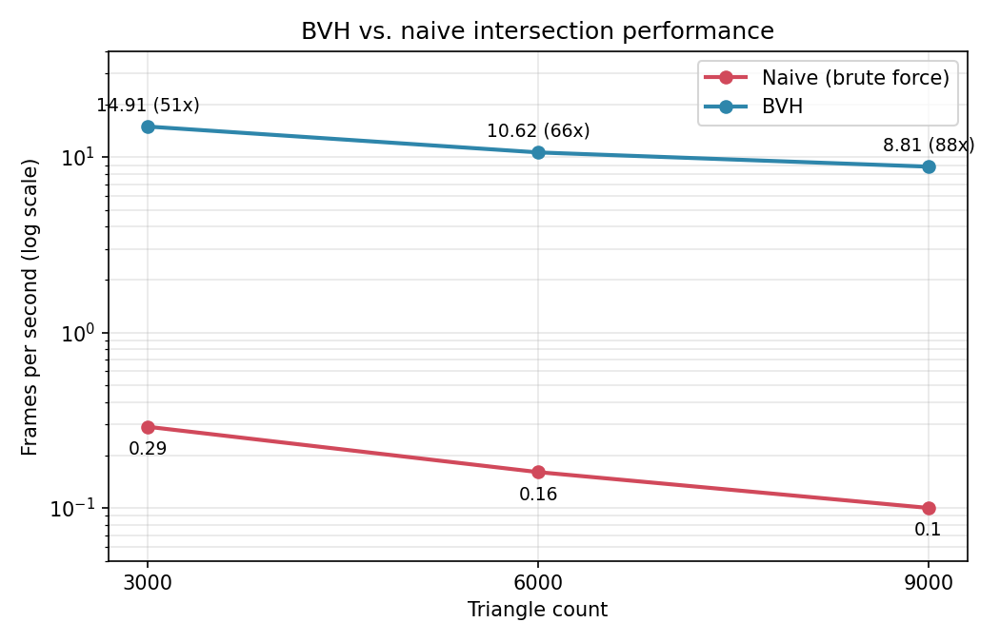

# CUDA Path Tracer

**University of Pennsylvania, CIS 5650: GPU Programming and Architecture, Project 3**

* Nico Kong
   [LinkedIn](https://www.linkedin.com/in/nicola-kong/), Email: nebfinn@gmail.com
* Tested on: Windows 11, AMD Ryzen AI 9 HX 370 @ 2.0GHz 32GB, RTX 4060 8GB (Personal Laptop)

## Overview

GPU path tracer written in C++ and CUDA that renders physically based images by tracing thousands of light paths per pixel in parallel. Supports loading scenes from a custom format in which glTF 3D models can be included. The render supports diffuse, mirror, refractive, and Fresnel-based dielectric materials. A thin-lens camera model adds depth of field and anti-aliasing.

For performance improvements, the renderer can build a BVH acceleration structure over the model's triangles and traverses it on the GPU, which can speed up the render time by 80x on a 9000-triagnle scene. There is also optional material sorting features that can further speed up the performance in specific scenarios.

## Features

* Diffuse, reflective and refractive materials
* Anti-aliasing
* Physically based camera with depth of field
* glTF model loading
* BVH acceleration structure

### Diffuse, Reflective and Refractive Materials

 

Diffuse Material: Scatters rays with cosine-weighted hemisphere sampling. the BSDF and PDF terms cancel and the path color is simply multiplied by the surface albedo.
Reflective Material: Perfect mirror reflection of the incoming ray about the surface normal, tinted by the material's specular color.
Refractive Material: Refracts rays through the surface using Snell's law and the material's index of refraction. flipping the normal and ratio when a ray exits the object.

### Anti-Aliasing

We achieve Anti-Aliasing by randomly jittering our ray direction within the pixel area in each iteration.

| Before (no AA), zoomed crop | After (AA), zoomed crop |
|:--:|:--:|
|  |  |

**Performance impact**

Since our pathtracer operates on a Monte-Carlos Estimation approach, unlike in an rasterized renderer, anti-aliasing is effectively free and doesn't have any performance impact.

| Setting | frame/second |
|---|---|
| AA off | 49.7 |
| AA on | 49.7 |

---

### Physically Based Camera with Depth of Field

Instead of a pin-hole camera model, this renderer supports a physically based camera with lens radius and focal distance property.

By sampling the lens position on a 2d disk using concentric mapping and recomputing ray direction through the focus point, we are able to render images with a depth of field effect, producing sharp imagery only at specific distances based on the focal length.

| Pinhole (no DOF) | Lens radius = 1.0, focal distance = 8.25 | Lens radius = 1.0, focal distance = 9.5 | Lens radius = 1.0, focal distance = 11.5 |
|---|---|---|
|  |  |  |  |

**Performance impact**

Similar to Anti-Aliasing, since our pathtracer operates on a Monte-Carlos Estimation approach, DOF effect is effectively free and doesn't require a significat amout of extra rendering time.

| Setting | frame/second |
|---|---|
| DOF off | 49.7 |
| DOF on | 49.9 |

### glTF Model Loading

Our renderer is able to load 3D triangle models from glTF scenes using the [tinygltf](https://github.com/syoyo/tinygltf) library.

### BVH Acceleration Structure

The most important performance optimization is the BVH acceleration structure, which turns the list of geometry from linear into a binary tree structure, effectvely reducing the intersection traversal runtime from theoretical O(n) to O(log(n)). The BVH is built on the CPU using the median split metric. this structure is then flattend into linear arrays of geometry data and tree nodes and sent to the gpu. This will significatly boost our runtime for rendering models with a high triangle count.

| Triangle Count | Naive (frames/second) | BVH (frames/second) | Speedup |
|---|---|---|---|
| 3000 | 0.29 | 14.91 | ~51x |
| 6000 | 0.16 | 10.62 | ~66x |
| 9000 | 0.10 | 8.81 | ~88x |

**Further optimization**

The basic traversal algorithm is by nature branchy and memory-incoherent. I suspect that this affects our runtime on GPU a lot and there are possible improvements that I could still make using methods like near-child-first ordering or better tree encoding methods.

## Credits and References

GLTF scene loading library:
[tinygltf](https://github.com/syoyo/tinygltf)
3D model used in showcase:
[Hatsune Miku Plushie by revworks](https://skfb.ly/pxRGB)
Code referenced:
[PBRTv4 5.2.3](https://pbr-book.org/4ed/Cameras_and_Film/Projective_Camera_Models#TheThinLensModelandDepthofField)
[PBRTv4 9.2](https://pbr-book.org/4ed/Reflection_Models/Diffuse_Reflection)
[PBRTv4 9.3](https://pbr-book.org/4ed/Reflection_Models/Specular_Reflection_and_Transmission)

## Note for graders

I am currently missing some analysis required in the assignment instruction. I used to much time to finish the code and unfortunately didn't have enough time to finish up every section required.